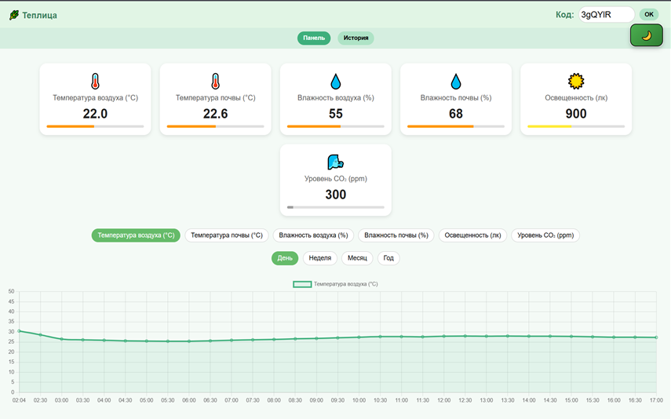

[](https://teplica.denserver.ru)
[](LICENSE)
[](https://github.com/DenSawer)
[](README_EN.md)
[](README.md)

# 🌿 Teplica — Блок автоматизации и управления теплица

Полноценная IoT-система для мониторинга и управления теплицей.  
Проект развёрнут на: **[teplica.denserver.ru](https://teplica.denserver.ru)**
⚠️Сайт временно не доступен из-за перееезда на другой сервер⚠️



---

## 📦 Структура проекта

```
/
├── firmware/              # Код для ESP32
│   ├── Teplica/           # Основной код прошивки
│   ├── libraries/         # Сторонние библиотеки
│   └── sd/                # Файлы для SD-карты
├── server/
│   ├── backend/           # C++ сервер (Crow)
│   └── web-interface/     # Веб-интерфейс: HTML, JS, CSS
├── LICENSE                # MIT лицензия
└── README.md              # Этот файл
```

---

## ⚙️ Как работает система

1. **ESP32** считывает данные с датчиков (температура, влажность, CO₂ и др.)
2. Отправляет их в формате JSON на API:
   ```
   POST https://teplica.denserver.ru/api/upload/{device_id}
   Content-Type: application/json
   ```
3. **C++ сервер** (на Crow) принимает данные, сохраняет в `data_*.json`
4. **Веб-интерфейс** отображает эти данные в виде графиков

---

## 🔧 Backend

Находится в `server/backend/`

- Написан на C++ с использованием Crow (легковесный REST-фреймворк)
- Обработка POST-запросов от ESP и сохранение в JSON
- Поддержка HTTPS через nginx (конфиг можно добавить отдельно)

### ▶️ Сборка

```bash
cd server/backend
mkdir build && cd build
cmake ..
make
./teplica-api
```

---

## 🌐 Веб-интерфейс

Находится в `server/web-interface/`

- `index.html` + `chart.min.js`
- Подключается к `data_{КОД}.json`, отображает текущие и архивные данные введенного кода

---

## 📡 Firmware (ESP32)

Расположена в `firmware/Teplica/`

- Написана на базе Arduino IDE
- Использует Wi-Fi, SIM, Ethernet для выхода в Интернет
- Использует датчики CO₂ (SCD30, SCD4x), температуры и влажности воздуха (DHT22, BME280, SHT2x, SHT3x, SHT4x), температуры почвы (DS18B20), влажность почвы (емкостной датчик влажности) и уровня освещенности (BH1750) для считываний показаний микроклимата
- Использует SD-карту для хранения информации
- Настройки Wi-Fi, ID устройства и URL API задаются

---

## 🌍 Демо

Сайт: **https://teplica.denserver.ru**  
API: `https://teplica.denserver.ru/api/upload/{device_id}`

